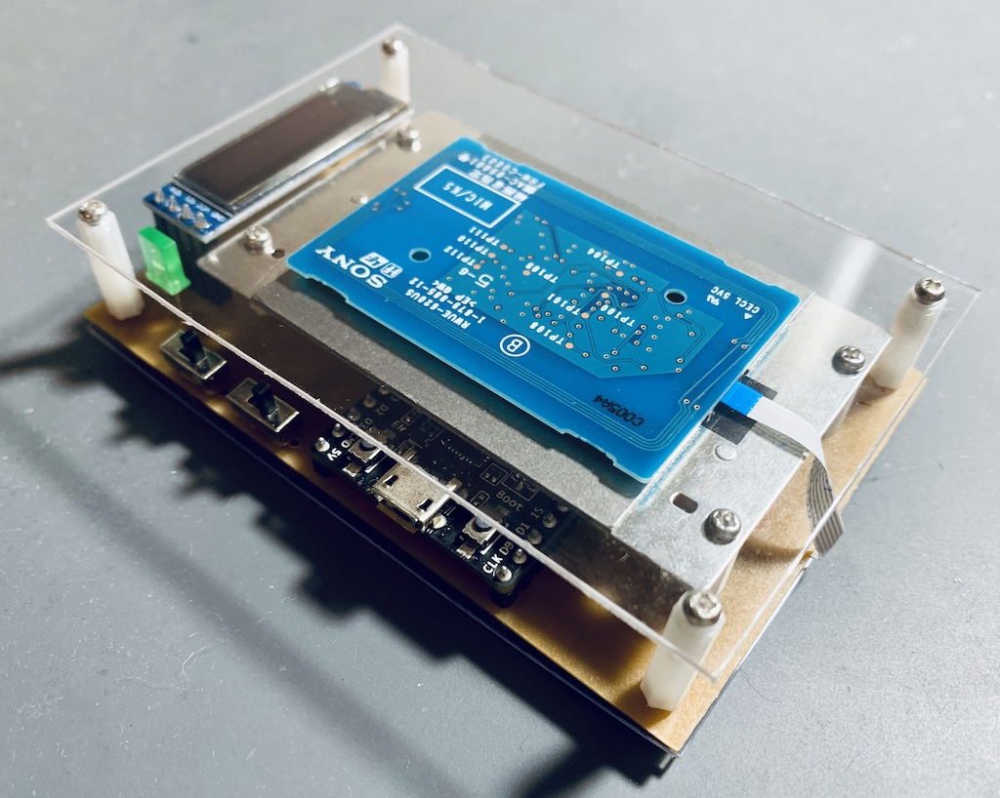

# CERS-terminal

[CERS-terminal](https://github.com/greenlaver/CERS-terminal) is the terminal device developed for [CERS(COVID-19 Entrance Recording System)](https://github.com/Yukiho-YOSHIEDA/CERS).

## Device Design

Schematic and board design files are contained in [KiCad](KiCad).

## Dependencies

Works on ESP32, developed with [Arduino IDE](https://www.arduino.cc/en/main/software).

- [ArduinoHkNfcRw](lib/ArduinoHkNfcRw) : RC-S620S Customized Arduino R/W library
- [U8g2](https://github.com/olikraus/u8g2) : 2.27.6
- [ArduinoJson](https://github.com/bblanchon/ArduinoJson) : 6.14.0
